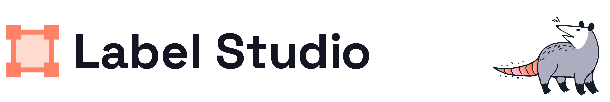

This tutorial walks you through installing Label Studio in a local development environment.

## About Label Studio

{fig-align="center"}

Label Studio is an open-source data labeling platform that supports multiple projects, users, and data types.
Its simple, straightforward UI lets you label audio, text, images, videos, and time-series data and export annotations to a variety of model formats.
Use it to prepare raw data or refine existing training data and build more accurate ML models.^[https://github.com/HumanSignal/label-studio.]

## Prerequisites

Before you begin, make sure the following tools are installed in your local environment:

- Python 3.13 [Download](https://www.python.org/downloads)
- Yarn 1.22.22 [Download](https://github.com/yarnpkg/yarn)
- Node.js v24.13.1 [Download](https://nodejs.org/en/download)
- Git for Windows 2.53.0 [Download](https://git-scm.com/install/windows)

## 📥 1. Get the Source

Start by cloning the latest Label Studio source from its GitHub repository.

```bash
# Clone the repository (use --depth 1 for a faster, shallow clone)
git clone https://github.com/HumanSignal/label-studio.git --depth 1

# Move into the project root
cd label-studio
```

## 🐍 2. Set Up the Python Environment

```bash
# Install Poetry for Python dependency management
pip install poetry

# Verify Poetry is working
poetry env info

# Configure Poetry to create the virtual environment inside the project folder
poetry config virtualenvs.in-project true

# Install all Python dependencies
poetry install
```

## 🗄️ 3. Create the Database

```bash
# Run database migrations
poetry run python label_studio/manage.py migrate

# Collect static files (needed by the frontend)
poetry run python label_studio/manage.py collectstatic --noinput
```

## ⚛️ 4. Build Frontend Resources (Important!)

```bash
# Navigate to the frontend directory
cd web

# (Windows only) Point Yarn to Git Bash for script execution
yarn config set script-shell "~/Git/bin/bash.exe"

# Install frontend dependencies
yarn install --frozen-lockfile

# Build the frontend assets
yarn build

# Return to the project root
cd ..
```

Once the build completes, the compiled frontend files are placed in `web/dist/apps/labelstudio`.
This is the path Django reads from when collecting static files.

## 🔄 5. Collect Static Resources (Again!)

```bash
# Re-collect static files to pick up the freshly built frontend assets
poetry run python label_studio/manage.py collectstatic --noinput
```

## 🚀 6. Start the Dev Server

```bash
# Launch the development server
poetry run python label_studio/manage.py runserver
```

You can now access the Label Studio web interface at `http://localhost:8080`.